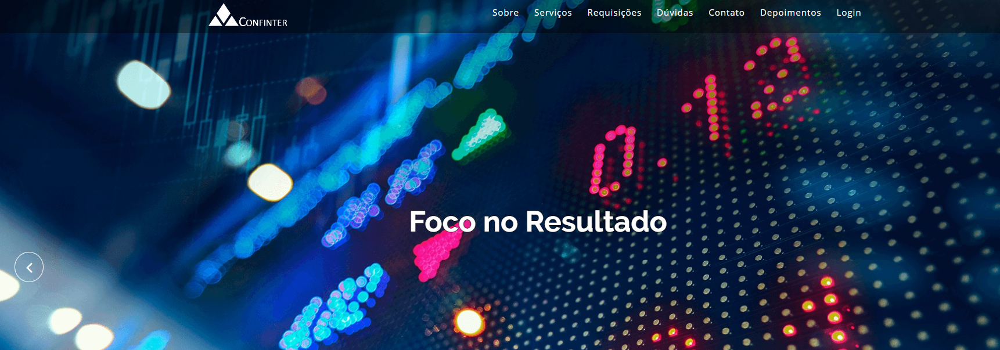

# 🕹 Criação do Projeto Integrador PI UNIVESP
> Criação do Projeto Integrador PI UNIVESP - 

## 📋 Índice
- [Link do projeto:](https://finandolopes.github.io/GRUPO-PI-TURMA-007/)

- [📖 Sobre](#-Sobre)
- [🚀 Tecnologias utilizadas](#-Tecnologias-utilizadas)
- [🖥 Preview](#-Preview)
- [📌 Créditos](#-Créditos)

## 📖 Sobre
 - Criação do Projeto Integrador PI UNIVESP

## 🚀 Tecnologias utilizadas
- `PHP`
- `HTML`
- `CSS`
- `Javascript`
- `MSQL`
- `Framework - Bootstrap`
## 🖥 Preview:

  

   

